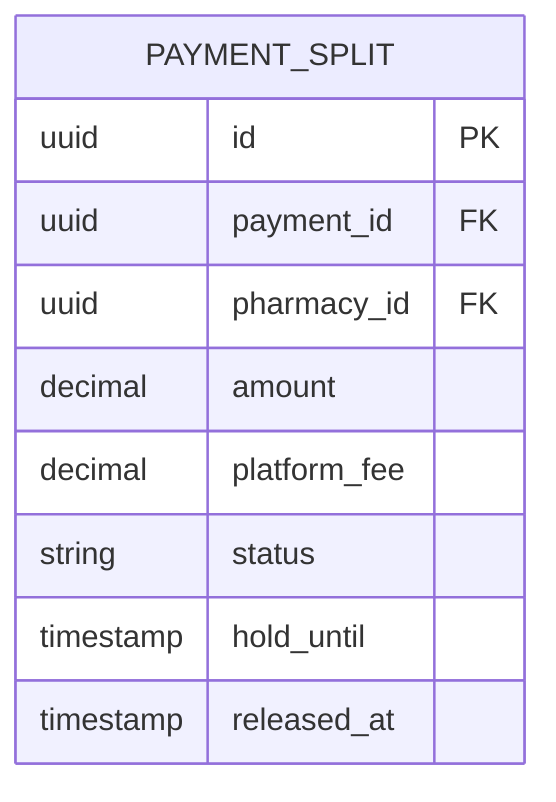
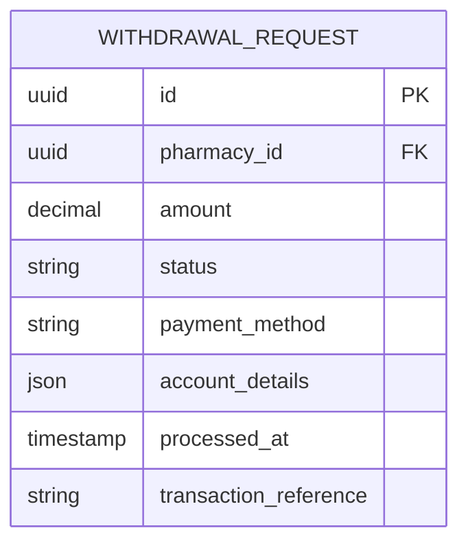

# Tenamart Payment Splitting & Withdrawal System

**Version**: 1.0  
**Last Updated**: November 1, 2025  
**Status**: Draft for Review

## Table of Contents
1. [Introduction](#1-introduction)
2. [System Architecture](#2-system-architecture)
3. [Data Model](#3-data-model)
4. [Payment Flow](#4-payment-flow)
5. [Withdrawal Process](#5-withdrawal-process)
6. [API Contract](#6-api-contract)
7. [Operational Runbook](#7-operational-runbook)
8. [Open Questions & Decisions](#8-open-questions--decisions)
9. [Acceptance Criteria](#9-acceptance-criteria)
10. [Appendices](#10-appendices)

## 1. Introduction

### 1.1 Purpose
This document defines the comprehensive design for Tenamart's payment processing system that handles multi-pharmacy order payments and enables pharmacies to request withdrawals of their earnings.

### 1.2 Scope
- Processing single payments for orders containing products from multiple pharmacies
- Accurately splitting payments according to business rules
- Managing fund allocation and withdrawal requests
- Handling exceptions including refunds and disputes
- Maintaining an immutable ledger of all financial transactions

### 1.3 Non-Goals
- Implementation of payment gateway integration code
- Execution of actual payouts (handled by operations team)
- Management of customer-facing payment interfaces

## 2. Business Rules

### 2.1 Core Payment Splitting Rules
1. **Revenue Share**
   - Each product's gross amount (price × quantity) is allocated to the owning pharmacy
   - Platform commission (e.g., 5%) is deducted from each pharmacy's share
   - Example: 
     ```
     Product A: 100 ETB (Pharmacy X)
     Product B: 200 ETB (Pharmacy Y)
     Platform Fee: 5%
     
     Pharmacy X Share: 100 - (100 * 0.05) = 95 ETB
     Pharmacy Y Share: 200 - (200 * 0.05) = 190 ETB
     ```

2. **Settlement Windows**
   - 3 business day hold period for order verification
   - Funds become available for withdrawal after hold period
   - Hold period starts when order status changes to 'delivered'

3. **Withdrawal Rules**
   - Minimum withdrawal amount: 500 ETB
   - Maximum withdrawal amount: 100,000 ETB per transaction
   - Processing time: 1-3 business days
   - Withdrawal fee: 10 ETB per transaction

4. **Refund Policy**
   - Full refunds: Deduct from pharmacy's available balance
   - Partial refunds: Prorate based on item value
   - If balance insufficient, create negative balance to be deducted from future earnings

## 3. Data Model

### 3.1 Core Entities

#### 3.1.1 PaymentSplit


#### 3.1.2 WithdrawalRequest


## 4. Payment Flow

### 4.1 Order Processing
1. Customer places order
2. System calculates splits:
   ```
   For each item in order:
       pharmacy_share = item_total - (item_total * platform_fee_percentage)
       Update pharmacy.available_balance += pharmacy_share
   ```
3. Funds held for 3 business days

## 5. Withdrawal Process

### 5.1 Request Flow
1. Pharmacy requests withdrawal
2. System validates:
   - Minimum amount (100 ETB)
   - Available balance
   - KYC status
3. Admin processes request
4. Funds transferred via bank transfer

## 6. API Contract

### 6.1 Get Pharmacy Balance
```http
GET /api/v1/pharmacy/balance
Authorization: Bearer {token}
```

**Response**
```json
{
  "data": {
    "available_balance": 15000.00,
    "pending_balance": 5000.00,
    "in_transit": 2000.00,
    "currency": "ETB",
    "last_payout": {
      "amount": 8000.00,
      "date": "2025-10-28T14:30:00Z",
      "status": "completed"
    },
    "next_available_payout_date": "2025-11-04T00:00:00Z"
  }
}
```

### 6.2 Request Withdrawal
```http
POST /api/v1/withdrawals
Authorization: Bearer {token}
Content-Type: application/json
X-Idempotency-Key: {unique_request_id}

{
  "amount": 10000.00,
  "payment_method": "bank_transfer",
  "account_details": {
    "bank_name": "Commercial Bank of Ethiopia",
    "account_number": "1000234567890",
    "account_name": "Tenamart Pharmacy",
    "branch_name": "Bole Branch"
  },
  "purpose": "regular_withdrawal"
}
```

### 6.3 Get Withdrawal Status
```http
GET /api/v1/withdrawals/{withdrawal_id}
Authorization: Bearer {token}
```

**Response**
```json
{
  "data": {
    "id": "with_1234567890",
    "amount": 10000.00,
    "fee": 10.00,
    "net_amount": 9990.00,
    "status": "processing",
    "requested_at": "2025-11-01T14:30:00Z",
    "estimated_completion_date": "2025-11-04T23:59:59Z",
    "payment_method": "bank_transfer",
    "account_details": {
      "bank_name": "Commercial Bank of Ethiopia",
      "account_number_ending": "7890"
    },
    "transactions": [
      {
        "id": "txn_12345",
        "amount": -10000.00,
        "type": "withdrawal_debit",
        "status": "completed",
        "created_at": "2025-11-01T14:30:05Z"
      }
    ]
  }
}
```

## 7. Operational Runbook

### 7.1 Daily Payout Processing
1. **Preparation**
   ```bash
   # 1. Generate pending withdrawals report
   php artisan reports:generate pending-withdrawals --date=YYYY-MM-DD
   
   # 2. Verify available balance in bank account
   php artisan payouts:verify-balance
   
   # 3. Process payouts
   php artisan payouts:process --test-run  # Dry run first
   php artisan payouts:process --limit=50  # Process in batches of 50
   ```

2. **Verification**
   - Check success/failure reports in `/storage/reports/payouts/YYYY-MM-DD/`
   - Verify total amount matches bank transfer records
   - Update status of processed payouts

### 7.2 Handling Failed Payouts
1. **Automatic Retry**
   - System automatically retries 3 times with exponential backoff
   - After final failure, status changes to 'requires_attention'
   
2. **Manual Resolution**
   - Check failure reason in admin dashboard
   - Verify pharmacy bank details
   - Contact pharmacy if information is incorrect
   - Process manual transfer if needed
   - Update status and add notes

3. **Notification**
   - Email sent to pharmacy with failure reason
   - Alert sent to ops team
   - Ticket created in support system

### 7.3 Dispute Resolution
1. **Initial Triage**
   - Freeze disputed amount
   - Assign to dispute resolution team
   - Notify all parties within 24 hours

2. **Investigation**
   - Gather order details and communication history
   - Contact customer and pharmacy
   - Review evidence
   - Make determination within 5 business days

3. **Resolution**
   - Process refund if claim is valid
   - Release funds to pharmacy if claim is invalid
   - Update ledger with resolution details
   - Notify all parties of outcome

## 8. Edge Cases & Resolution

### 8.1 Partial Refunds After Payout
**Scenario**: Customer requests refund for an order after pharmacy has been paid out.

**Resolution**:
1. Deduct refund amount from pharmacy's next payout
2. If no future payouts, create negative balance
3. Send notification to pharmacy with details

### 8.2 Failed External Payouts
**Scenario**: Bank transfer to pharmacy fails after funds are debited from platform account.

**Resolution**:
1. Mark transaction as 'failed'
2. Create credit entry in pharmacy's ledger
3. Notify operations team and pharmacy
4. Process manual transfer or update bank details

### 8.3 Multi-Order Disputes
**Scenario**: Dispute covers multiple orders in same payment transaction.

**Resolution**:
1. Allocate dispute amount proportionally across orders
2. Apply hold to corresponding pharmacy balances
3. Resolve each order's portion independently

### 8.4 Rounding Differences
**Policy**:
- Round to nearest ETB (0.50 and above rounds up)
- Platform absorbs rounding differences under 0.50 ETB
- Document all rounding adjustments in transaction notes

## 9. Acceptance Criteria

### 9.1 Engineering Requirements
- [ ] **Payment Processing**
  - [ ] Correctly splits payments across multiple pharmacies
  - [ ] Applies platform fees accurately
  - [ ] Handles partial and full refunds
  - [ ] Enforces hold periods

- [ ] **Withdrawal System**
  - [ ] Processes withdrawal requests within 24h
  - [ ] Validates minimum/maximum amounts
  - [ ] Handles concurrent requests safely
  - [ ] Generates proper audit logs

- [ ] **API Endpoints**
  - [ ] Implements all specified endpoints
  - [ ] Validates all inputs
  - [ ] Returns appropriate status codes
  - [ ] Includes rate limiting

### 9.2 QA Test Cases
- [ ] **Payment Splitting**
  - [ ] Single pharmacy order
  - [ ] Multi-pharmacy order
  - [ ] Mixed cart with different commission rates
  - [ ] Edge cases (zero amount, single item, etc.)

- [ ] **Withdrawal Flow**
  - [ ] Successful withdrawal
  - [ ] Insufficient funds
  - [ ] Invalid bank details
  - [ ] Concurrent requests

- [ ] **Error Handling**
  - [ ] Network failures
  - [ ] Invalid inputs
  - [ ] System outages
  - [ ] Data corruption

## 10. Appendices

### 10.1 Status Codes
| Code | Description                     |
|------|---------------------------------|
| 200  | Success                         |
| 201  | Created                         |
| 202  | Accepted (processing)           |
| 400  | Bad Request                     |
| 401  | Unauthorized                    |
| 403  | Forbidden                       |
| 404  | Not Found                       |
| 409  | Conflict (duplicate request)    |
| 422  | Validation Error                |
| 429  | Too Many Requests               |
| 500  | Internal Server Error           |
| 503  | Service Unavailable             |

### 10.2 Error Responses
#### Insufficient Funds
```json
{
  "error": {
    "code": "insufficient_funds",
    "message": "Insufficient available balance",
    "available_balance": 5000.00,
    "minimum_required": 10000.00,
    "currency": "ETB"
  }
}
```

#### Invalid Bank Details
```json
{
  "error": {
    "code": "invalid_bank_details",
    "message": "The provided bank account could not be verified",
    "field": "account_number",
    "suggestion": "Please verify the account number and try again"
  }
}
```

### 10.3 Sample UI Copy
#### Balance Overview
```
Available Balance: 15,000.00 ETB
Pending Clearance: 5,000.00 ETB
Next Payout: November 4, 2025

[Request Withdrawal] [View Transaction History]
```

#### Withdrawal Status
```
Withdrawal Request #WDR-12345
Amount: 10,000.00 ETB
Status: Processing
Estimated Completion: November 4, 2025

We're processing your withdrawal request. You'll receive a confirmation email once completed.
```

### 10.4 FAQ for Pharmacies
#### When will I receive my money?
Funds are typically available for withdrawal 3 business days after order delivery. Once you request a withdrawal, processing takes 1-3 business days.

#### Is there a minimum withdrawal amount?
Yes, the minimum withdrawal amount is 500 ETB.

#### What payment methods are supported?
We currently support bank transfers to Ethiopian bank accounts.

#### How are refunds handled?
Refunds are deducted from your available balance. If your balance is insufficient, the amount will be deducted from future earnings.

#### Who should I contact for payment issues?
Please contact our support team at payments@tenamart.com or call +251-XXX-XXXXXX for any payment-related inquiries.
